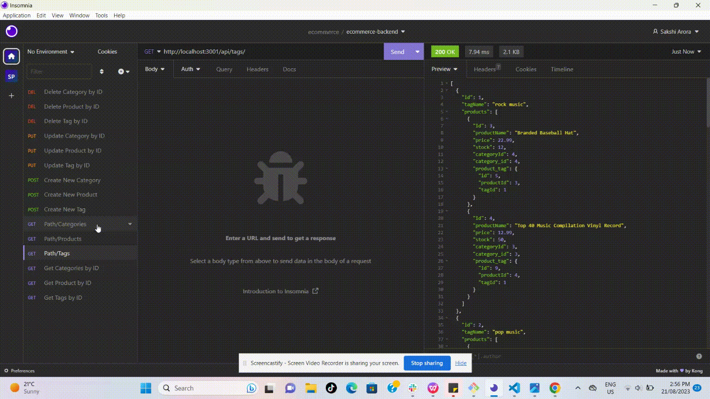
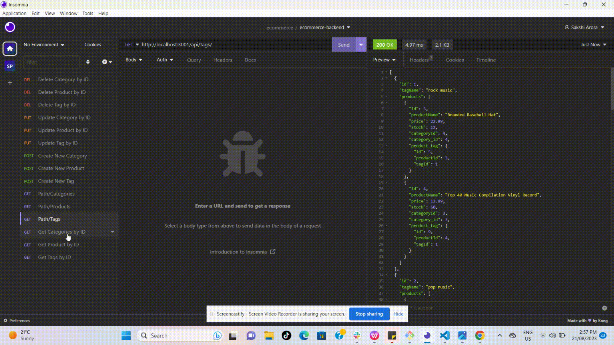
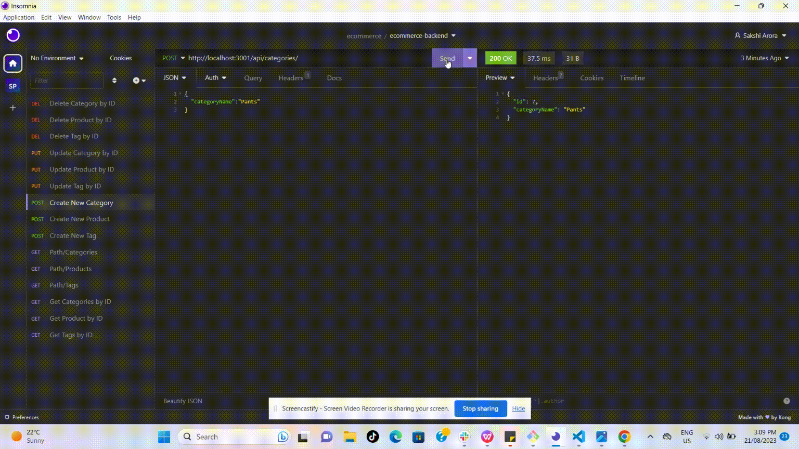
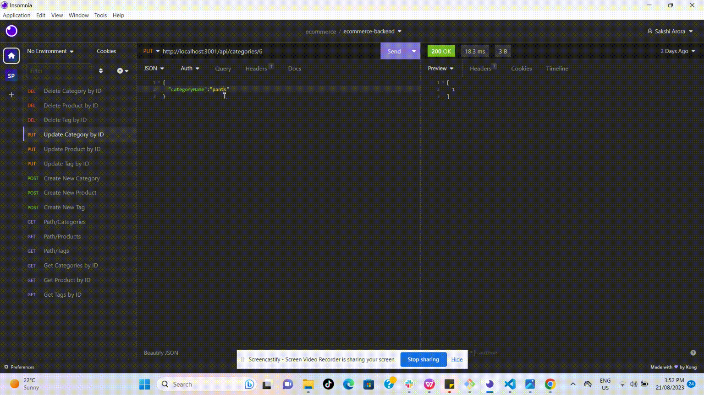
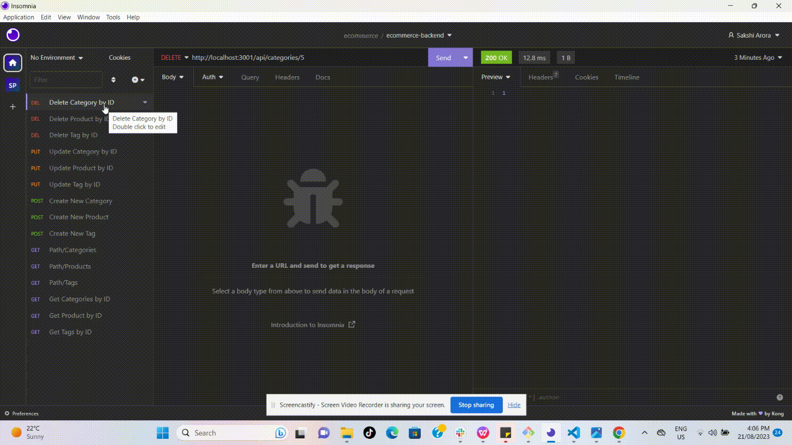

# E-Commerce Backend

## Description

E-commerce backend application is made to meet database requirements of ecommerce website using node.js, Express.js API, insomnia and sequelize to connect with MYSQL database. Sequelize helps us to perform operations without writing raw sql commands. This application is able to create, read, update and delete data in database with API routes in insomnia. We have created database models for tables and build associations to create relationship between them by using Sequelize. Category, Product and Tag are main models (tables). There is one more junction table ProductTag to build relationship between Product and Tag.

Following associations are used to create relationship:
```
 Category has many Products
 Products belongs to Category
 Products belong to many Tags (through ProductTag)
 Tags belong to many Products (through ProductTag)
```


## Table of Contents

- [Installation](#installation)
- [Usage](#usage)
- [Credits](#credits)
- [Contact Information](#contact-information)

## Installation

To run locally on command line

1. Clone the Repository from GitHub
   ```
   git clone git@github.com:sakshiarora04/e-commerce.git
   ```
2. Open the terminal and navigate to root directory. Install required dependencies given in package.json by running command:
   ```
   npm install
   ```
3. Create .env file in root directory and enter the required values in DB_USER and DB_PASSWORD

   ```
   DB_NAME='ecommerce_db'
   DB_USER=''
   DB_PASSWORD=''   
   ```   
4. Run mysql -u root -p then enter password. It will open MYSQL shell. Run below given command to create database

   ```
   SOURCE db/schema.sql
   ```
5. By opening the terminal again on root directory. Run below given command to seed database with test data

   ```
   npm run seed
   ```
    In the end, run 'npm start' to start the server and test the routes in insomnia.
## Usage

After following all steps of installation, it will get connected to server and ready to test API routes on insomnia.

- When user opens API GET routes in Insomnia Core by replacing options in http://localhost:3001/api/options with categories, products, or tags then the data for each of these routes is displayed in a formatted JSON. User can also open API get by id route by using http://localhost:3001/api/options/id, then data will be displayed for that particular id.
- When User test API POST route to create category, product and tag using api/options path, then data gets added to database. For creating product, we can enter value for tagIds key to add relevant tag ids.
- User can test API PUT route to update by id using api/options/id path. While updating, user can change any column data or all columns data at once. For updating product, there is facility to update tag ids and category id.
- When user test API DELETE route to delete by id using api/options/id path, it deletes the data related to that id. If we delete the category by id then relevant product also gets deleted. But if we delete product and tag by id then only selected option by id gets deleted.

Link to walkthrough video in google drive:

https://drive.google.com/file/d/1ftvp_eKKsjcB2-skT58VWQ7bQEXCn3sh/view?usp=sharing

The following images show the web application's appearance and functionality:

- GET routes to get category, product and tag

  

- GET routes by ID to get category, product and tag of particular id

  

- POST routes to create category, product and tag

  

- PUT routes to update by id category, product and tag of particular id

  

- DELETE routes to delete category, product and tag of particular id

  


## Credits

References:

https://sequelize.org/docs/v6/core-concepts/assocs/

## Contact Information

Github Username: [sakshiarora04](https://github.com/sakshiarora04)

Email id: sakshiarora245@gmail.com
